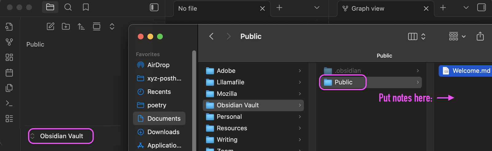
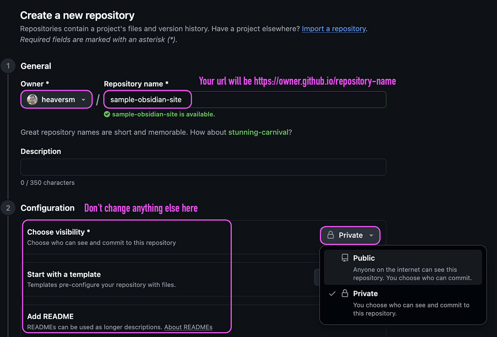

# Obsidian Website

These scripts help you publish your Obsidian vault's public folder to a website using GitHub Pages and [Quartz](https://quartz.jzhao.xyz/). 

** Features:**

- full-text search
- graph view visuaizer
- notes directory menu
- auto-synced with your Obsidian vault


## How it works

This script clones the Quartz repo to a directory of your choosing, prompts you for your Obsidian vault's public folder, and gets you around some of the logistical hurdles you would otherwise encounter setting up Quartz to publish to github pages. It makes an easy one-click deploy script inside the Quartz repo that you can click any time you want to publish updates to your notes. 

## Prerequisites

- [Git](https://git-scm.com/): Make sure you have the git CLI installed on your system
- [GitHub](https://github.com/): Make sure you have an empty repository. 
- [Obsidian](https://obsidian.md/): Make sure you have a vault with the notes you want to publish inside a folder called "Public"



## Setup

Follow the instructions below, or watch the video tutorial on youtube: 

- Windows Tutorial - coming soon
- [Mac Tutorial](https://youtu.be/g7wCk5YmyqU):


1. Clone this repo to a directory of your choosing
2. Make an empty github repository




3. Open a terminal and `cd` to the /scripts directory where you cloned this repo (you can also just drag the scripts folder from Finder / File Explorer into your terminal / powershell window)

## How to run (Mac)

1. Open Terminal and run:

``` bash
chmod +x ./quartz-setup-mac-main-plus.sh
./quartz-setup-mac-main-plus.sh
```

2. When the prompts appear, choose all the defaults (enter key):

   -   Initialize content → Empty folder
   -   Resolve links → File name

3. In GitHub, make sure your repo is set to use GitHub Actions:
   
**Settings → Pages → Source = GitHub Actions**


4. Publish / Update:

Once that's set, you can publish your notes (or any subsequent changes you make to notes in your Obsidian vault's Public Folder) by changing to the Quartz repo directory that you specified in the script and running:

- **Terminal**: `./deploy_main.sh`
- **Or double-click the file**: `Deploy Quartz.command`

---


## How to run (Windows)

1. Open **PowerShell** , change to the scripts directory inside where you cloned this repo, and run:

   ``` powershell
   Set-ExecutionPolicy -Scope Process -ExecutionPolicy Bypass
   .\quartz-setup-windows-main-final.ps1
   ```

2. Hit enter to use all the defaults on prompts:

   -   Initialize content → Empty folder
   -   Resolve links → File name

3. In GitHub, make sure your repo is set to use GitHub Actions:
   
**Settings → Pages → Source = GitHub Actions**


4. Publish / Update:

Once that's set, you can publish your notes (or any subsequent changes you make to notes in your Obsidian vault's Public Folder) by changing to the Quartz repo directory that you specified in the script and running:

- **PowerShell**: `C:\Sites\quartz\deploy_main.ps1`
- **Or double-click the file:**: `Deploy-Quartz.cmd`

---

You can see your site's URL in Github from the Settings > Pages tab (it will always follow the convention https://[github_username].github.io/[repo_name]).